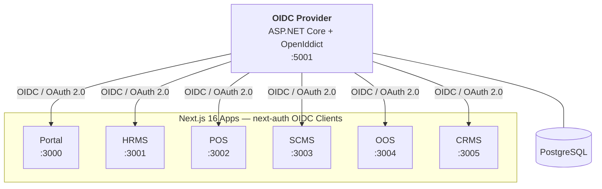

<div align="center">

# Bren Raphael's Enterprise Suite — Auth Service

**Centralized identity and authentication platform for all enterprise applications.**

[](https://github.com/deveramartin/br-auth-service/actions/workflows/ci-api.yml)
[](https://github.com/deveramartin/br-auth-service/actions/workflows/ci-web.yml)
[](https://github.com/deveramartin/br-auth-service/actions/workflows/docker-build.yml)


</div>

---

## Overview

A monorepo housing the single OIDC provider (OpenIddict) for all company applications. Six Next.js apps are registered as OIDC clients and rely on this service for login, session management, and fine-grained permissions.

### Repository Structure

```
├── apps/
│   ├── api/internal-auth-service/   # ASP.NET Core 10 — OIDC Provider (OpenIddict)
│   └── web/
│       ├── portal/                  # Next.js 16 — Authenticated dashboard & admin
│       └── landing/                 # Next.js 16 — Public systems overview & docs
├── packages/                        # Shared utility libraries
├── .github/workflows/               # CI/CD pipelines
└── docker-compose.yml               # Container orchestration
```

---

## Tech Stack

| Layer | Technology |
|---|---|
| **Backend** | C# / .NET 10 Web API, ASP.NET Identity, OpenIddict |
| **Frontend** | TypeScript, Next.js 16 (App Router), Tailwind CSS v4, shadcn/ui |
| **Auth** | OpenIddict (OIDC), `next-auth@beta` |
| **Database** | PostgreSQL |
| **Package Manager** | npm (workspaces) |
| **Containerization** | Docker / Docker Compose |

---

## Prerequisites

| Dependency | Version |
|---|---|
| Node.js | 22+ |
| .NET SDK | 10.0+ |
| mkcert | Latest |
| PostgreSQL | 15+ |

---

## Getting Started

### 1. Local HTTPS Certificates (`mkcert`)

Both the API and Web applications run on HTTPS locally. We use `mkcert` to manage local self-signed certificates.

**Install mkcert:**

| OS | Command |
|---|---|
| macOS | `brew install mkcert` |
| Linux | `sudo apt install mkcert` |
| Windows | `choco install mkcert` |

**Setup local CA and generate certificates:**

```bash
mkcert -install

cd apps/api/internal-auth-service && mkcert localhost
cd apps/web/portal && mkcert localhost
cd apps/web/landing && mkcert localhost
```

> Certificates (`localhost.pem`, `localhost-key.pem`) are gitignored and never committed.

---

### 2. Environment Setup

Copy the example environment files and fill in your configuration:

```bash
# Auth Service (API) — SMTP, Client, Auth Service URL
cp apps/api/internal-auth-service/.env.example apps/api/internal-auth-service/.env

# Web Portal — OIDC client config
cp apps/web/portal/.env.example apps/web/portal/.env.local

# Landing Page — system URLs
cp apps/web/landing/.env.example apps/web/landing/.env.local
```

Generate `AUTH_SECRET` for the Next.js portal:

```bash
openssl rand -base64 32
```

> **Important:** Never commit `.env` or `.env.local` files. Only `.env.example` is tracked.

---

## Development

### Install Dependencies

```bash
npm install
```

### Run All Services

```bash
npm run dev
```

### Run Individual Services

| Service | Command |
|---|---|
| Auth Service (API) | `npm run dev:api` |
| Portal (Web) | `npm run dev:web` |
| Landing Page | `npm run dev:landing` |

### Build

| Target | Command |
|---|---|
| Portal | `npm run build:web` |
| Landing | `npm run build:landing` |
| API | `npm run build:api` |

### Lint

| Scope | Command |
|---|---|
| All workspaces | `npm run lint` |
| Portal only | `npm run lint:web` |
| Landing only | `npm run lint:landing` |

---

## Service Ports

| Service | URL | Description |
|---|---|---|
| Auth Service (API) | `https://localhost:5001` | OIDC provider, identity management |
| Portal | `https://localhost:3000` | Admin dashboard, app launcher |
| Landing Page | `https://localhost:3010` | Public docs, FAQ, systems overview |
| HRMS | `https://localhost:3001` | Human Resource Management |
| POS | `https://localhost:3002` | Point of Sale |
| SCMS | `https://localhost:3003` | Supply Chain Management |
| OOS | `https://localhost:3004` | Online Shop |
| CRMS | `https://localhost:3005` | Customer Relationship Management |

---

## Docker

```bash
# Spin up all containers
npm run docker:up

# Stop containers
npm run docker:down
```

---

## Architecture



---

## CI/CD

GitHub Actions workflows are configured under `.github/workflows/`:

| Workflow | Trigger | Purpose |
|---|---|---|
| **CI — API** | Push/PR to `apps/api/**` | Build + test the .NET API |
| **CI — Web** | Push/PR to `apps/web/**` | Lint + build Next.js apps |
| **Docker Build** | Push to `main` | Build and push container images |

---

## Contributing

1. Create a feature branch from `main`
2. Follow [Conventional Commits](https://www.conventionalcommits.org/) — `feat(portal):`, `fix(auth-service):`, etc.
3. Run lint + build before committing
4. Stage only relevant files (never `git add .` blindly)
5. Submit a PR — don't push directly to `main`

---

## License

This project is licensed under the [MIT License](./LICENSE). You are free to use, modify, and distribute this software — just include the original copyright notice and license in any copies or substantial portions.

© 2026 Fitzjaymar Jude de Vera Martin. All rights reserved.
